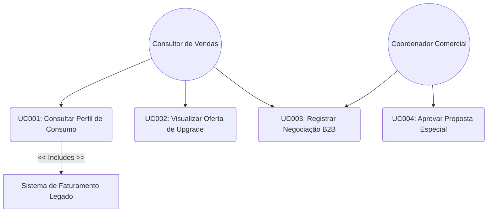

# Modelagem UML: Diagrama de Casos de Uso (Use Cases) 📊

Este documento descreve formalmente o comportamento dinâmico do CRM de Telecomunicações através da especificação de Casos de Uso na linguagem UML. Ele detalha as fronteiras do sistema, seus atores e as principais funcionalidades modeladas.

---

### 🗺️ Diagrama Visual (Renderizado em Mermaid)

O gráfico abaixo ilustra graficamente os atores do ecossistema de vendas da operadora interagindo com as funcionalidades do CRM. O GitHub desenhará o gráfico automaticamente na tela:

---

### 📝 Descrição Detalhada dos Casos de Uso

#### UC001: Consultar Perfil de Consumo
- **Ator Principal:** Consultor de Vendas.
- **Ator Secundário:** Sistema de Faturamento Legado (Fornece a massa de dados históricos).
- **Pré-condição:** O consultor precisa estar autenticado no CRM e com o CPF/CNPJ do cliente selecionado.
- **Fluxo Principal:**
  1. O consultor insere o identificador do cliente.
  2. O CRM faz uma requisição ao sistema de faturamento legado.
  3. O CRM consolida os dados de telefonia móvel e banda larga fixa.
  4. O CRM renderiza a visão consolidada dos últimos 3 meses na tela.

#### UC002: Visualizar Oferta de Upgrade
- **Ator Principal:** Consultor de Vendas.
- **Pré-condição:** Sucesso na execução do UC001 (Consultar Perfil de Consumo).
- **Fluxo Principal:**
  1. O sistema analisa os dados carregados no perfil de consumo.
  2. O motor de ofertas identifica se o cliente cumpre os critérios de elegibilidade (ex: estouro de franquia recorrente).
  3. O CRM exibe um pop-up visual com a sugestão do novo plano e o argumento de venda.

#### UC003: Registrar Negociação B2B
- **Ator Principal:** Consultor de Vendas ou Coordenador Comercial.
- **Fluxo Principal:**
  1. O usuário acessa a aba "Pipeline de Vendas" da conta corporativa.
  2. O usuário atualiza o status do funil comercial (ex: alteração de *Em Negociação* para *Ganho*).
  3. O usuário anexa a proposta comercial assinada pelo cliente.
  4. O sistema valida os campos obrigatórios e salva as alterações na base de dados.
